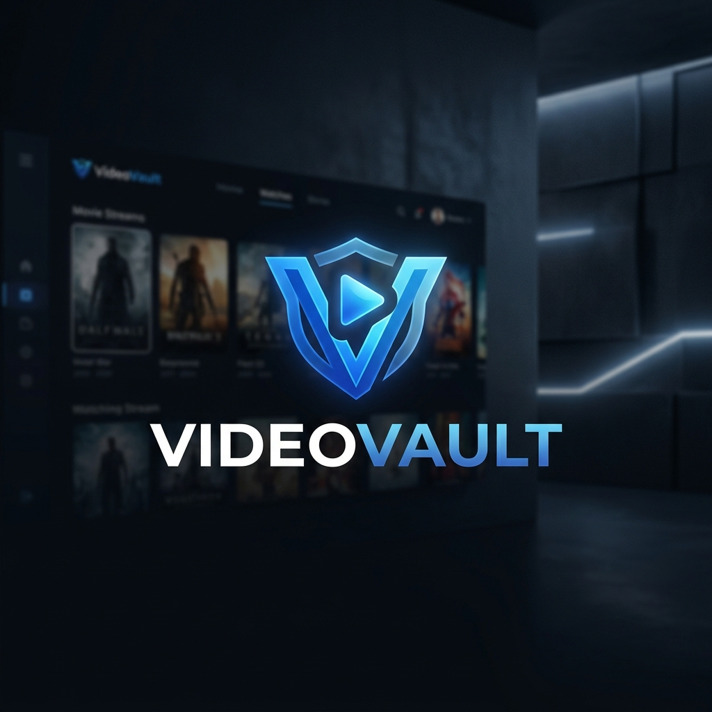

# 🎥 VideoVault | Premium Media Delivery Pipeline

**VideoVault** is a high-performance, multi-tenant media streaming platform engineered for the modern web. It bridges the gap between secure storage and cinematic delivery, featuring real-time transcoding, granular RBAC, and seamless Cloudinary integration.

## 🖼️ Gallery

<carousel>

<!-- slide -->

<!-- slide -->

<!-- slide -->

</carousel>

## ✨ Key Features

-   **☁️ Cloud-Native Transcoding**: Powered by Cloudinary. No local `ffmpeg` setup required. Automatic resolution normalization and thumbnail generation.
-   **🔐 Enterprise RBAC**: Multi-tenant architecture with strictly enforced roles:
    -   **Admin**: Full organization management, user role control, and media deletion.
    -   **Editor**: Upload, manage, and monitor video processing pipelines.
    -   **Viewer**: Secure, high-speed streaming access.
-   **⚡ Real-Time Telemetry**: WebSocket-driven progress mapping (Socket.io) with a backend persistent auto-sync fallback.
-   **📱 Cinematic UI**: Dark-mode primary aesthetic built with Tailwind CSS 4, Framer Motion animations, and Lucide icons.
-   **🛡️ Hardened Security**: JWT-based stateless authentication, Helmet security headers, and rate-limiting.

---

## 🛠️ Tech Stack

-   **Frontend**: React 19, Vite, Tailwind CSS 4, Framer Motion, Socket.io-client.
-   **Backend**: Node.js, Express, MongoDB (Mongoose), Cloudinary SDK.
-   **Infrastructure**: Docker Compose, Multer (Memory Storage), JWT.

---

## 🚀 Quick Start

### 1. Prerequisites
-   Node.js (v18+)
-   MongoDB Atlas Cluster
-   Cloudinary Free Account

### 2. Environment Configuration

Create a `.env` file in the `backend/` directory:

```env
PORT=5000
MONGODB_URI=your_mongodb_connection_string
JWT_SECRET=your_jwt_secret
CLOUDINARY_CLOUD_NAME=your_cloud_name
CLOUDINARY_API_KEY=your_api_key
CLOUDINARY_API_SECRET=your_api_secret
```

### 3. Installation & Boot

```bash
# In the root directory
# Install backend dependencies
cd backend && npm install

# Install frontend dependencies
cd ../frontend && npm install

# Start the cluster (Simultaneously)
# Terminal 1: Backend
cd backend && npm run dev

# Terminal 2: Frontend
cd frontend && npm run dev
```

---

## 🏗️ Architecture Overview

VideoVault utilizes a **Stream-to-Cloud** pipeline:
1.  **Ingestion**: Multer intercepts video uploads into RAM buffers.
2.  **Streaming**: Buffered data is piped directly to Cloudinary via secure upload streams.
3.  **Transcoding**: Cloudinary handles background normalization and metadata extraction.
4.  **Delivery**: Frontend streams via Cloudinary's Global CDN using secure, time-limited URLs.
5.  **Reliability**: The Dashboard maintains a dual-layer sync (Sockets + 10s DB Polling) to ensure processing status is always accurate.

---

## 👑 Role Hierarchy

| Feature | Admin | Editor | Viewer |
| :--- | :---: | :---: | :---: |
| Watch Videos | ✅ | ✅ | ✅ |
| Upload Videos | ✅ | ✅ | ❌ |
| Manage Org Users | ✅ | ❌ | ❌ |
| Delete Videos | ✅ | ❌ | ❌ |
| Edit Metadata | ✅ | ✅ | ❌ |

---

## 📜 Deployment Guide

### Railway / Render (Backend)
-   Root Directory: `backend/`
-   Start Command: `npm start`
-   Build Command: `npm install`

### Vercel (Frontend)
-   Framework Preset: `Vite`
-   Root Directory: `frontend/`
-   Environment: Set `VITE_API_URL` to your production backend URL.

---

*Developed by Rupak Ghosh & Antigravity AI*
